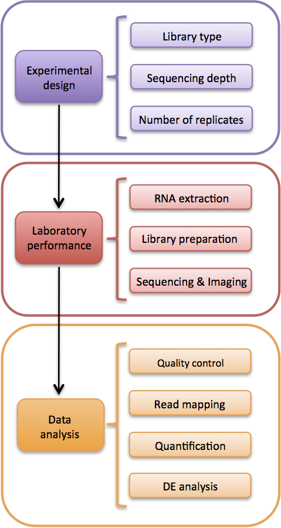
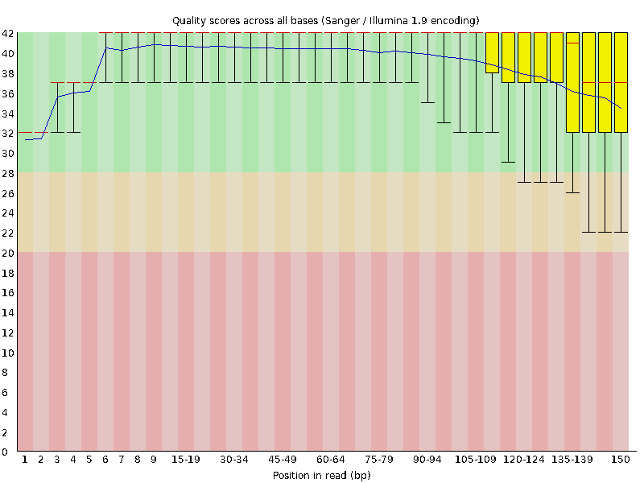
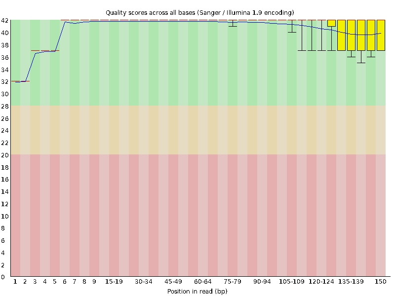
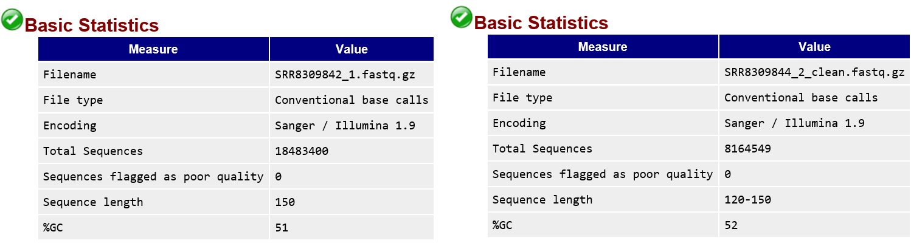

## RNA-seq Data
In this lab we are going to be introduced to gene expression data obtaine by RNA-seq, using next generation sequencing techniques. In this particular case the data is obtianed by Illumina HiSeq 2500 machine. This will produce [paired end reads](https://www.illumina.com/science/technology/next-generation-sequencing/paired-end-vs-single-read-sequencing.html). 
Here we are extracting gene expression data for Escherichia coli str. K-12 species. There are in total 6 sequencing [samples](https://www.ncbi.nlm.nih.gov/sra/?term=Escherichia+coli+str.+K-12+RNA+seq), but for now we are only going to extract 3 of them. You can extract the raw reads in [fastq](https://en.wikipedia.org/wiki/FASTQ_format) format by going to the [EBI](https://www.ebi.ac.uk/) website and simply pasting the sample accession numbers there. For todays experiment we're extracting sequence data with the following accessions:
* SRR8309842
* SRR8309843
* SRR8309844

The typical steps taken to obtain these raw reads RNA-seq data are:
1) deciding on library types, sequencing depth, number of replicates etc.
2) Extracting the RNA seqs, preparing libraries.
These processes generate short reads in fastq format, such as the ones that we are going to deal with today. 
Following these steps comes data preparation and analysis, which we will be going through today. These steps include:
1) quality control: seeing if the reads are of high quality and postprocessing them if needed (trimming etc)
2) mapping the reads to a reference sequence (in our case, or to contigs in other cases), using some maping tool
3) quantification of abundance of these genes.
4) differential expression analysis.



The most common way of presenting raw reads is in Fastq format. Below is an example of one read:
```
@SRR8309842.1 1/1
NTAATACTGGCTGTGAGTGCGTTGGTACTGACGTTGTGGGGAAGCGATAAAATCGTTGCTACCGGCGTGGCGATTATCTGGGGGCTAACTTTTGCATTGGTTCCCGTCGGCTGGTCAACGTGGATCACCCGCTCGCTGGCCGATCAGGCA
+
#AAFFKKKKKKKKFKAFFFKKFKKKKFKKKKKKKKKKKKKKFKKKKFKFKKAKKKKKKKKKKKKKKKKKKKKKKKKKKKKKKKKKF7FKKKKKKFKKKKKKKKKKKK7AFFKKKKKFKKKKKKAFA<KKKKFFA,AFKKA<AFKKFA<F7

```
Each read is composed of four lines. The first line begins with the @ symbol, which indicates the header of that read. Second line is the raw sequecne letters. Line three begins with a '+' sign, and the fourth line is the quality of the read presented in line 2. The values of these characters indicating read quality from low to high is as follows:
```
!"#$%&'()*+,-./0123456789:;<=>?@ABCDEFGHIJKLMNOPQRSTUVWXYZ[\]^_`abcdefghijklmnopqrstuvwxyz{|}~
```

### Quality Control of your data
FastQC is a popular tool to perform quality assessment. As a general rule, read quality decreases towards the 3’ end of reads, and if it becomes too low, bases should be removed to improve mappability. Otherwise we will end up having ambiguous reads and later will create problems when we try to map these reads back to a reference genome, and we will be uncertain whether or not these maps are due to error or are actual biological signal.
Lest first check the quality of the reads we downloaded using [FastQC](https://www.bioinformatics.babraham.ac.uk/projects/fastqc/)
to get FastQC please go to this [link](https://www.bioinformatics.babraham.ac.uk/projects/fastqc/fastqc_v0.11.8.zip) or issue a wget command in your shell
```
wget https://www.bioinformatics.babraham.ac.uk/projects/fastqc/fastqc_v0.11.8.zip
and then make it executable
chmod +x fastqc
```
and then update your ~/.bashrc file to locate the FastQC executables. i.e.:
```
export PATH="/home/mstambou/FastQC/:$PATH"
```

we can use two methods to generate fastqc reports over the fastq reads, the interactive way or through comamnd line. Let's use command line to check the quality of our reads. We can issue a command i.e.:
```
fastqc SRR8309844/SRR8309844_2.fastq.gz -t 10 -d fastqc_reports/
```
to generate an html formatted report. A good tutorial to understand the different compomnents of the report and how to analyze results would be [here](https://www.youtube.com/watch?v=bz93ReOv87Y)



It's quite common for NGS sequenceres, especially for illumina technologies that the read quality towards the end of the reads would start degrading. The character read quality indicators are converted to a [phred](https://en.wikipedia.org/wiki/Phred_quality_score) quality score. In this case the scoring is [Illumina 1.9 encoding](https://www.drive5.com/usearch/manual/quality_score.htm), as a general rule of thumb scores above 20 are considered to be good and the ones below that value would be better off if they were trimmed. Fortunately in our case all the reads are of higher quality and in a typical case we do not need to post process the reads and trim them.

### Trimming poor reads
Just for the sake of demonstration we will trim some of the reads using a tool caleld [Trimmomatic](http://www.usadellab.org/cms/?page=trimmomatic).
Again this tool could be obtained from its website by issuing a wget command, and then updating the $path varialble to encorporte its executable:
```
wget http://www.usadellab.org/cms/uploads/supplementary/Trimmomatic/Trimmomatic-0.38.zip
export PATH="/home/mstambou/trimmomatic/Trimmomatic-0.38/:$PATH"
```
Let's trim one of the paired end reads. using the reads under the folder SRR8309842:, by issuing the following command:
```
java -jar /home/mstambou/trimmomatic/Trimmomatic-0.38/trimmomatic-0.38.jar PE -phred33 -threads 24 SRR8309842/SRR8309842_1.fastq.gz SRR8309842/SRR8309842_2.fastq.gz SRR8309842/SRR8309842_1_clean.fastq.gz SRR8309842/SRR8309842_1_clean_unpaired.fastq.gz  SRR8309842/SRR8309842_2_clean.fastq.gz SRR8309842/SRR8309842_2_clean_unpaired.fastq.gz SLIDINGWINDOW:4:30 MINLEN:120
```
In this command I'm telling the program to go over the paired end reads using a sliding window of size 4 and trim any read that falls below a score of 30 (very strict in this case to see some difference) and also discard any read that is less than 120 bases.

After postprocessing and discarding some of the low quality reads using the Trimmomatic tool, let us again visualize the reads using FastQC.



Number of reads before and after trimming

