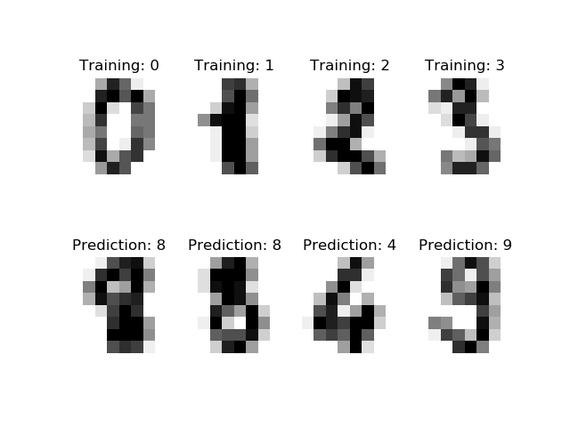
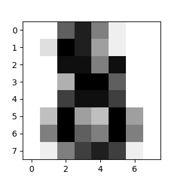

In the next few weeks we will talk about some machine learning algorithms and their application. We will not be implimenting these algorithms but will be using packages that allready implemented the. The main package we will be using is [scikit-learn](http://scikit-learn.org/). This is the most widely used machine learning package for python. There are so many excellent tutorials on scikit-learn, in these next few labs we are going to practive some tutorials and uses of this ML algorithms by first understanding how they work and testing them over different types of datasets. I will be emphasizing important points through experience. 

We will start with the [scikit-learn basic tutorial](http://scikit-learn.org/stable/tutorial/basic/tutorial.html).
Scikit-learn is famous for its excellent documentation which is also a great resource for machine learning in general.
This simple tutorial walks us through the organization of scikit-learn and introduces the generic methods `fit()` and `predict()` implemented for various classifiers.

We will start with the [scikit-learn basic tutorial](http://scikit-learn.org/stable/tutorial/basic/tutorial.html).
Scikit-learn is famous for its excellent documentation which is also a great resource for machine learning in general.
This simple tutorial walks us through the organization of scikit-learn and introduces the generic methods `fit()` and `predict()` implemented for various classifiers.

Generally speaking, a learning problem considers a set of n samples of data and then tries to predict properties of unknown data. If each sample is more than a single number and, for instance, a multi-dimensional entry (aka multivariate data), it is said to have several attributes or features. As you might have heard before machine learning is generally split between unsupervised learning and supervised learning. Although there are also semi-supervised learning approaches, and reinforcement learning methods, however in this class we will focus only on supervised and unsupervised methods. We have allready seen some unsupervised methods such as our clustering algorithms (k-means, hierarchical clustering etc...). So whats the difference between supvervised and unsupervised?:

## General Machine Learning Concepts:

### General Machine Learning approaches

* [supervised learning](https://en.wikipedia.org/wiki/Supervised_learning), in which the data comes with additional attributes that we want to predict. This problem can be either:

   * [classification](https://en.wikipedia.org/wiki/Statistical_classification): samples belong to two or more classes and we want to learn from already labeled data how to predict the class of unlabeled data. An example of a classification problem would be handwritten digit recognition, in which the aim is to assign each input vector to one of a finite number of discrete categories. Another way to think of classification is as a discrete (as opposed to continuous) form of supervised learning where one has a limited number of categories and for each of the n samples provided, one is to try to label them with the correct category or class.
[regression](https://en.wikipedia.org/wiki/Regression_analysis): if the desired output consists of one or more continuous variables, then the task is called regression. An example of a regression problem would be the prediction of the length of a salmon as a function of its age and weight.

* [unsupervised learning](https://en.wikipedia.org/wiki/Unsupervised_learning), in which the training data consists of a set of input vectors x without any corresponding target values. The goal in such problems may be to discover groups of similar examples within the data, where it is called clustering, or to determine the distribution of data within the input space, known as density estimation, or to project the data from a high-dimensional space down to two or three dimensions for the purpose of visualization (Click here to go to the Scikit-Learn unsupervised learning page).

### Traning and Test Datasets
Another important concept in machine learning is the idea of having a training set and a test set.

Machine learning is about learning some properties of a data set and then testing those properties against another data set. A common practice in machine learning is to evaluate an algorithm by splitting a data set into two. We call one of those sets the training set, on which we learn some properties; we call the other set the testing set, on which we test the learned properties.

As mentioned above we will conver ML algorithms using a very convenient python package called SK-learn. We will see how this package makes machine learning easy to use.

## Loading and preprocessing datasets to Learn and Predict.

Now enough with the talking and let us see some examples of what we just talked about. The way these classic machine learning algorithms were designed and coded in SK-learn python package, is that they take data in the form of a matrix of intigers or floating numbers or categorical features, where Rows are considered to be the different data points and columns are considered to be the different features or attributes of your data (which also define the dimensionality of your data). So if we are given an nxm matrix and knowing that it is a training data set we can assume that we have n different data points where each different data point has m different attributes. Note, ideally all the data points within the same data set would have the same number of features, some datapoints would have missing values in some of their features which is also fine since data is not perfect in reality. There are various techniques on how to deal with missing values, you could either ignore those rows altogether if they are not alot, or average those values out, or try to predict missing values. We will talk about these techniques later. Usually the last or first column in datasets are the target in which we are trying to learn and predict. 

To be able to import and run SK-learn on the server I installed my own copy of python3 unders the folder software on tank severs, so that I can install any package that we would need. To be able to run python from my installed directory all you have to do is to change pythons path in your bashrc file. Simply add these three lines:

```
#adding python3 path here:
export PATH="/u/i529/software/anaconda3/bin:$PATH"
export python3="/u/i529/software/anaconda3/bin/python3.7"
export PATH="${PATH}:/u/i529/software/anaconda3/bin/python3.7"
```

SK-learn even provides us with pre-existing datasets (benchmarking datasets) so that we can try and test our predictors on them. Some of the more famous datasetsare [iris](https://en.wikipedia.org/wiki/Iris_flower_data_set) and [digits](http://archive.ics.uci.edu/ml/datasets/Pen-Based+Recognition+of+Handwritten+Digits) datasets for classification and the [boston house prices](https://archive.ics.uci.edu/ml/machine-learning-databases/housing/) dataset for regression.

Let's first load some data sets into variables and play with them:

```python
from sklearn import datasets
iris = datasets.load_iris()
digits = datasets.load_digits()
```
These datasets provide to us by sklearn are preprocessed for us and ready to be used by the predictors hence we do not need to process the datasets first to make put it in format that would be recognized by the functions. The way these datasets are organized are in the form of dictionaries. In this dictionary object data is stored, a matrix cotanining all the features of the different points, another vector containing the class lables (if classification) or targets (if its a regression problem). There might be one or more response variables in case of supervised learning. Let's take a closer look to what the digits.data looks like:

```python
print(digits.data)
print(digits.target)
```
These two commands would show us the feature space of our data, and the target that we are trying to learn and predict, which is the ground truth. Now let's check out the shape of this digits dataset:

```python
print(digits.images[0])
```
As we can see a matrix encoding of all the digits between 0 to 9, are presented to us. the intensity of the ink on paper is encoded in numbers which are digitalized and given in the form of matrices so that it could be used by ML algorithms.




## Learning and Predicting over datasets

Let's use this digits data set to train a model and then try to predict what numbers are written on paper. So in this case the task is to predict, given an image, which digit it represents. We are given samples of each of the 10 possible classes (the digits zero through nine) on which we fit a classifier in this case to be able to predict the classes to which unseen samples belong. This task of fiting a model and later predicting values is made super easy in sklearn:

In scikit-learn, an estimator for classification is a Python object that implements the methods fit(X, y) and predict(T).
For this example we will use Support vector machines to classify these numbers. For now let's just treat SVMs as black boxes.

```python
from sklearn import svm
clf = svm.SVC(gamma=0.001, C=100.)
```
In this example, we set the value of gamma manually. To find good values for these parameters, we can use tools such as [grid search](https://scikit-learn.org/stable/modules/grid_search.html#grid-search) and [cross validation](https://scikit-learn.org/stable/modules/cross_validation.html#cross-validation). 

The clf (for classifier) estimator instance is first fitted to the model; i.e. we learn the data first. This is done by passing our training set to the fit method. For the training set, we’ll use all the images from our dataset, except for the last image, which we’ll reserve for our predicting. We select the training set with the [:-1] Python syntax, which produces a new array that contains all but the last item from digits.data, basically we skip the last data point in our learning (not to over fit):

```python
clf.fit(digits.data[:-1], digits.target[:-1])  
SVC(C=100.0, cache_size=200, class_weight=None, coef0=0.0,
  decision_function_shape='ovr', degree=3, gamma=0.001, kernel='rbf',
  max_iter=-1, probability=False, random_state=None, shrinking=True,
  tol=0.001, verbose=False)
  ```
  Now that we tweaked and adjusted (i.e. trained) our machine learning algorithm we are ready to predict new (previously unseen) values based on solely from their features. Let's predict the class for the last data points since we did not include it in our training. By predicting, you’ll determine the image from the training set that best matches the last image.
  ```python
 clf.predict(digits.data[-1:])
```
The image from that digitized matrix is the following. Would you agree with the predictor? As you can see the task is not that trivial since the image is of poor quality (represented only 16b16 pixels).




All of these commands that we ran today could be found [here](ML_intro.py)
