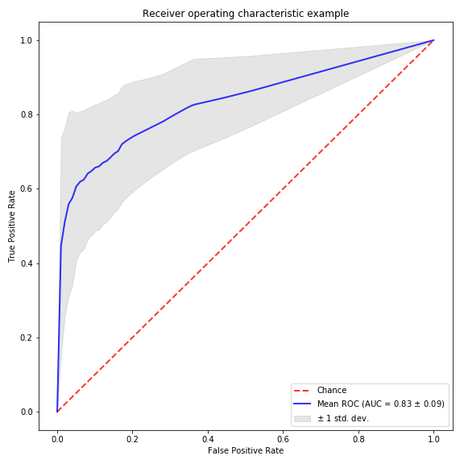

This week we're doing things slightly differently. For today's lab it will be more hands on. I will provide you with breast cancer classification dataset and you will work throughout the lab to develop your own classifier, instead of me demonstrating. However there will be a small demo first by me. 

Brief background about the dataset:
Todays dataset is called the P53 dataset. P53 is known as the tumor protein also known as tumor suppressor p53 in humans. This protein prevents cancer formation, thus, functions as a tumor suppressor. As such, p53 has been described as "the guardian of the genome" because of its role in conserving stability by preventing genome mutation. Hence TP53 is classified as a tumor suppressor gene. We can only imagine then what mutations within this gene would lead to.

To obtain this dataset go to your home directories that I have created for you and issue the following command:
```
wget https://archive.ics.uci.edu/ml/machine-learning-databases/p53/p53_new_2012.zip
unzip p53_new_2012.zip
```
The main data is found in the file K9.data. The file has 31,159 rows (data points) and 5408 columns (features). The last column is the class variable and could take the values 'active' or 'inactive', based on thegenes transcription activity. 


Using this dataset, I have trained and tested a classifier, called ["myClassifier.py"](myClassifier.py), the task is can you beat my classifier's performance?. To test the performance I did a 10-fold cross validation and plotted the ROC curve and calculted the Area Under the Curve. The values that I obtained was 0.83, could you do better than that?



I would expect you also to perform n-fold cross validation using your classifiers and generate ROC curves so that we can compare our results.

To compensate for your efforts I will give you 1 BONUS point over your final average <br/>for the course for each extra 0.1 points that your classifier achieves over my reported <br/> AUC. i.e if your classifier achieves and AUC of 0.93 I will reward your with 1 extra point over your final average.

Good luck!
